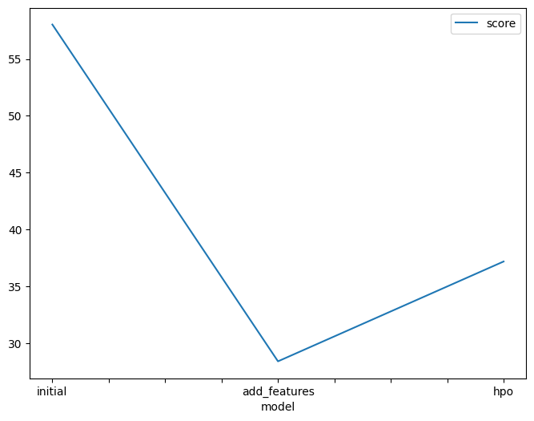
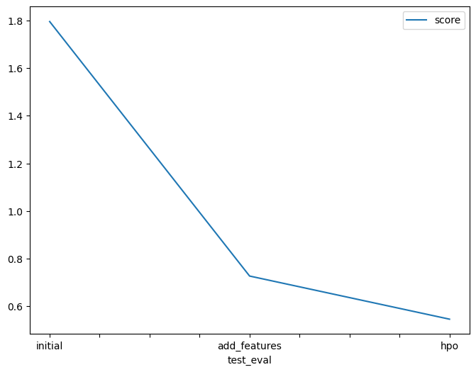

# Report: Predict Bike Sharing Demand with AutoGluon Solution
#### NAME HERE
Shakil Mosharrof
## Initial Training
### What did you realize when you tried to submit your predictions? What changes were needed to the output of the predictor to submit your results?
- Model with raw data performed poor.
- In order to overcome this, I had to tweak and do some feature engineering.
- Kaggle doesn't take negative values, so I had to ensure that there wasn't any.

### What was the top ranked model that performed?
- `WeightedEnsemble_L3` Model

## Exploratory data analysis and feature creation
### What did the exploratory analysis find and how did you add additional features?
- Split the datetime column into four separate features: year, month, day, and hour to leverage their individual contributions to the final prediction of count.
- Ensure that the categorical data (season and weather) is encoded as categorical variables rather than integers to preserve their qualitative nature and prevent misinterpretation as numerical values.

### How much better did your model preform after adding additional features and why do you think that is?
- The model's performance improved significantly from a score of 1.79502 (raw data) to 0.72724 (with added features) on test sets.
- This improvement can be attributed to adding new features, which aids in predicting the target value and identifying seasonal patterns within the model.
- Ensuring that categorical data is set to the dtype of category rather than int also contributes to the model's enhanced performance, particularly with Autogluon.

## Hyper parameter tuning
### How much better did your model preform after trying different hyper parameters?
- Hyperparameter tuning was implemented to enhance performance.
- The initial scoring on the test data was 1.79502.
- After tuning, the performance improved to a score of 0.54626.
- While there was an improvement, it wasn't a substantial one.

### If you were given more time with this dataset, where do you think you would spend more time?
- Perform additional data analysis to gain deeper insights into the dataset.
- Dedicate more time to understanding the various features and patterns within the data.
- Explore different visualization techniques to uncover hidden relationships and trends.
- Conduct thorough research on hyperparameter tuning methods.
- Experiment with various hyperparameters to optimize model performance.
- Consider leveraging techniques such as grid search or random search for hyperparameter optimization.
- Evaluate the impact of different hyperparameters on model performance through experimentation.
- Continuously iterate and refine the model based on the insights gained from data analysis and hyperparameter tuning.

### Create a table with the models you ran, the hyperparameters modified, and the kaggle score.
|model       |hpo1       |hpo2         |hpo3        |score  |
|------------|-----------|-------------|------------|-------|
|initial     |default_val|default_val  |default_val |1.79502|
|add_features|default_val|default_val  |default_val |0.72724|
|hpo         |num_leaves:|dropout_prob:|num_round:  |0.54626|
|            |lower=26,  |0.0,         |100         |       |
|            |upper=66   |0.5          |            |       |

### Create a line plot showing the top model score for the three (or more) training runs during the project.

TODO: Replace the image below with your own.

### Create a line plot showing the top kaggle score for the three (or more) prediction submissions during the project.

TODO: Replace the image below with your own.

## Summary
I used AutoGluon to predict bike-sharing demand, with "Predictor_new_features" emerging as the top-performing model, achieving a Kaggle score of 0.54626 on the testing dataset. By conducting comprehensive exploratory data analysis (EDA) and implementing feature engineering techniques, the model's performance witnessed a substantial improvement of 82%. Furthermore, training the model with diverse hyperparameters yielded favorable results compared to the baseline model.
